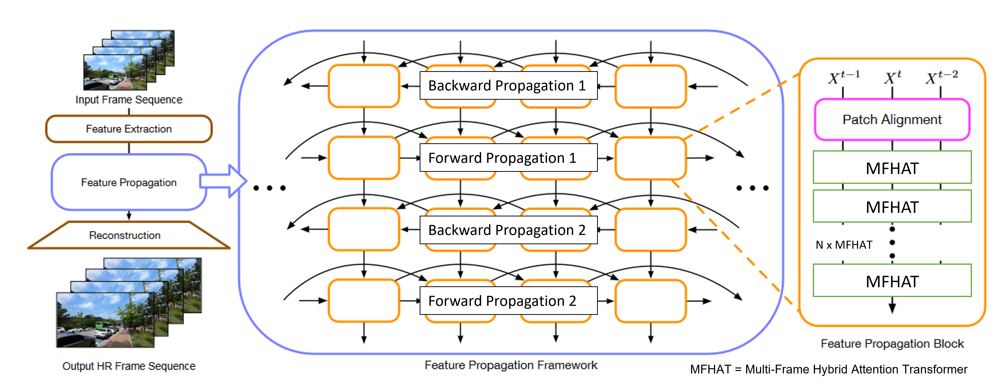

# Recurrent Hybrid Attention Transfomer (RHAT)
[Manopat Chankla](https://www.linkedin.com/public-profile/settings?lipi=urn%3Ali%3Apage%3Ad_flagship3_profile_self_edit_contact-info%3BORb2sHfDR%2BCDTMolAq1ecA%3D%3D)
**|**


This repository is the PyTorch implementation of Recurrent Hybrid Attention Transformer, a part of my senior project at Chulalongkorn University. You can find the project ([report](https://drive.google.com/file/d/1FtXInDeOUPHavFag_lv-trP-5SJg20Vn/view?usp=drive_link)) here.

We adopted the idea from "Rethinking Alignment in Video Super-Resolution Transformers"
([PSRT_arxiv](https://arxiv.org/pdf/2207.08494.pdf)) and extended the idea to hybrid attention context, proposed in "Activating More Pixels in Image Super-Resolution Transformer" ([HAT_arxiv](https://arxiv.org/abs/2309.05239)). 

## Recurrent Hybrid Attention Transformer
<p align="center">
  
</p>

## Requirements
> - Python 3.8, PyTorch >= 1.9.1
> - Requirements: see requirements.txt
> - Platforms: Ubuntu 18.04, cuda-11.1

## Quick Testing
 Prepare the [dataset](https://github.com/XPixelGroup/BasicSR/blob/master/docs/DatasetPreparation.md#Video-Super-Resolution) and change the file path in the inference code.

```bash
# download code
git clone https://github.com/SamaSa1710/RHAT.git
cd RHAT
pip install -r requirements.txt
pip install basicsr
python setup.py develop

# video sr trained on Vimeo, tested on Vimeo
python inference_RHAT_vimeo90k.py --vimeo data/meta_info_Vimeo90K_test_GT.txt --device 0
```
## Training
Prepare the corresponding datasets follwing the quick test stage. For better I/O speed, you can follow [data prepare instruction](https://github.com/XPixelGroup/BasicSR/blob/master/docs/DatasetPreparation.md#Video-Super-Resolution) to convert `.png` datasets to `.lmdb` datasets.

```bash
# download code
git clone https://github.com/SamaSa1710/RHAT.git
cd RHAT
pip install -r requirements.txt
pip install basicsr
python setup.py develop

# video sr trained on Vimeo, validated on Vid4

bash dist_train.sh 1 options/train/RHAT_mix_precision_Vimeo_300K_HAT.yml
```
## Results
<p align="center">
  
</p>

Please noted that the results are based on our experiments. We adopted pre-train model from HAT and performed frame-wise operation for Frame-wise HAT's results. Meanwhile, we trained PSRT and RHAT from scratch using our training configurations, which can be found in our [report](https://drive.google.com/file/d/1FtXInDeOUPHavFag_lv-trP-5SJg20Vn/view?usp=drive_link).


## Acknowledgment
Our codes was built on [PSRT](https://github.com/XPixelGroup/RethinkVSRAlignment)
and partially borrowed from [HAT](https://github.com/XPixelGroup/HAT) 
and from [BasicSR](https://github.com/XPixelGroup/BasicSR).
